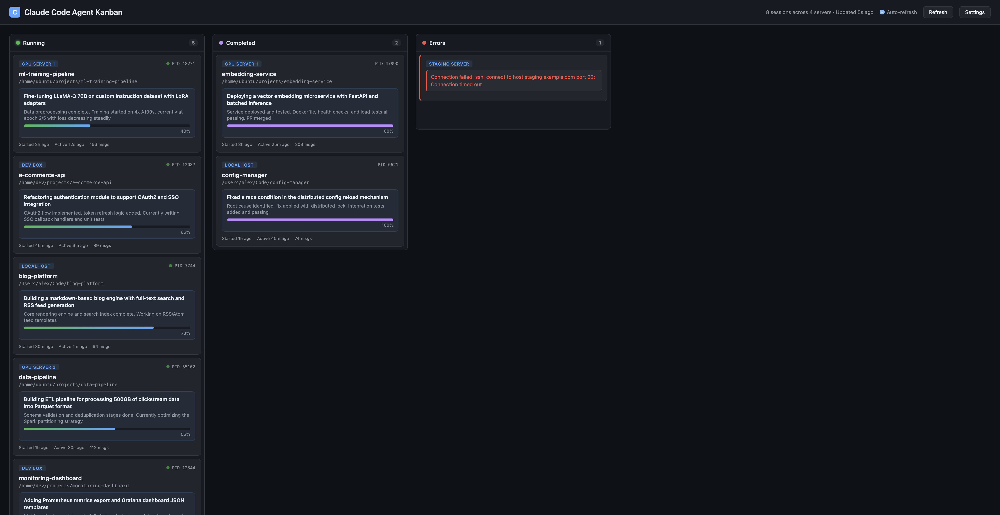

# Claude Code Agent Kanban

A real-time web dashboard that monitors [Claude Code](https://docs.anthropic.com/en/docs/claude-code) sessions across multiple servers, displaying them as a kanban board with AI-powered task summaries.

If you run Claude Code on multiple machines simultaneously, it's easy to lose track of what each agent is doing. This tool SSHs into your servers, collects all active sessions, and presents them in a single unified view.



## Features

- **Multi-server monitoring** — SSH into remote servers to collect session data in parallel
- **Live kanban board** — Sessions organized into Running / Completed / Errors columns
- **AI-powered summaries** — Each session is summarized by Claude (via local `claude` CLI) with task description, progress status, and estimated completion percentage
- **Auto-refresh** — Dashboard updates automatically; fast-polls on first load to pick up AI summaries quickly
- **Session lifecycle tracking** — Sessions move from Running to Completed when the Claude Code process exits; resumed sessions move back to Running
- **Web-based configuration** — Add/edit/remove SSH servers and test connections from the Settings panel, no config files needed
- **Summary caching** — Summaries are cached on disk; unchanged sessions won't be re-summarized, even across restarts

## Prerequisites

- Python 3.11+
- [uv](https://docs.astral.sh/uv/) package manager
- [Claude Code](https://docs.anthropic.com/en/docs/claude-code) CLI installed (used for AI summaries via `claude -p`)
- SSH key-based access to remote servers (for multi-server monitoring)

## Quick Start

### Install with uv (recommended)

```bash
uvx claude-kanban
```

### Install with pip

```bash
pip install claude-kanban
claude-kanban
```

### Run from source

```bash
git clone https://github.com/madsys-dev/claude-kanban.git
cd claude-kanban
uv run claude-kanban
```

Open http://localhost:5555 in your browser.

By default, it scans the local machine for Claude Code sessions. To add remote servers, click **Settings** in the top-right corner.

## How It Works

1. **Session discovery** — Scans `~/.claude/sessions/*.json` on each server to find active Claude Code processes
2. **Conversation parsing** — Reads the corresponding JSONL conversation logs from `~/.claude/projects/` to extract message history
3. **AI summarization** — Sends conversation excerpts (first 3 + last 6 messages) to `claude -p --model haiku` for summarization
4. **Lifecycle tracking** — When a session's PID disappears, it moves to the Completed column. If resumed, it moves back to Running

## Configuration

All configuration is done through the web UI (**Settings** button). Under the hood, settings are persisted to `~/.claude-kanban/config.yaml`:

```yaml
include_local: true
servers:
  - host: gpu-server-1.example.com
    user: ubuntu
    label: GPU Server 1
  - host: 10.0.0.50
    user: root
    port: 2222
    key: ~/.ssh/id_ed25519
    label: Dev Box
```

### Server options

| Field   | Required | Default          | Description                    |
|---------|----------|------------------|--------------------------------|
| `host`  | Yes      | —                | Hostname or IP                 |
| `user`  | No       | Current user     | SSH username                   |
| `port`  | No       | 22               | SSH port                       |
| `key`   | No       | `~/.ssh/id_rsa`  | Path to SSH private key        |
| `label` | No       | Same as host     | Display name on the dashboard  |

### Remote server requirements

- Python 3 installed
- Claude Code installed (sessions stored in `~/.claude/`)
- SSH key-based authentication configured

### Environment variables

| Variable         | Default                        | Description               |
|------------------|--------------------------------|---------------------------|
| `KANBAN_CONFIG`  | `~/.claude-kanban/config.yaml` | Path to configuration file |
| `KANBAN_DATA_DIR`| `~/.claude-kanban`             | Data directory for config and summary cache |

## API

| Endpoint                         | Method | Description                          |
|----------------------------------|--------|--------------------------------------|
| `GET /api/sessions`              | GET    | Returns all sessions (cached 30s)    |
| `POST /api/refresh`              | POST   | Force refresh and return sessions    |
| `GET /api/servers`               | GET    | List configured servers              |
| `POST /api/servers`              | POST   | Add a server                         |
| `PUT /api/servers/<id>`          | PUT    | Update a server                      |
| `DELETE /api/servers/<id>`       | DELETE | Remove a server                      |
| `POST /api/servers/<id>/test`    | POST   | Test SSH connection                  |
| `PUT /api/config/local`          | PUT    | Toggle local machine scanning        |

## License

MIT
